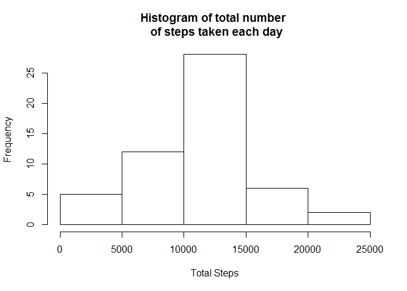
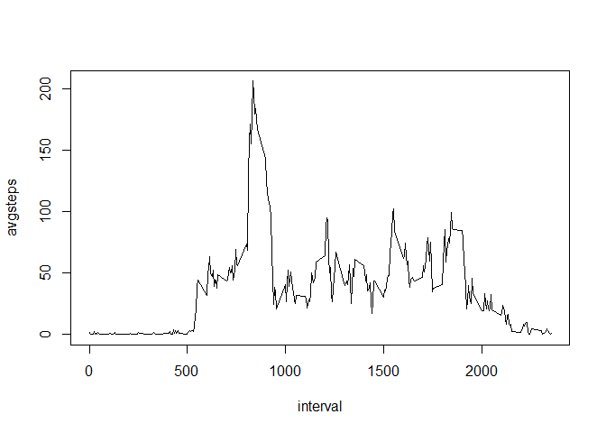
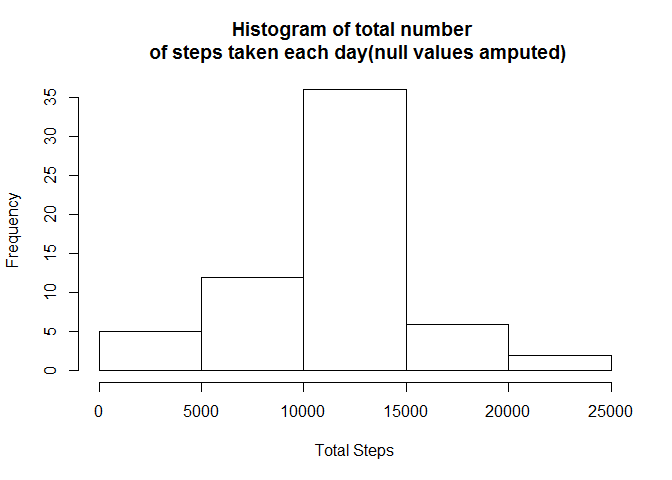
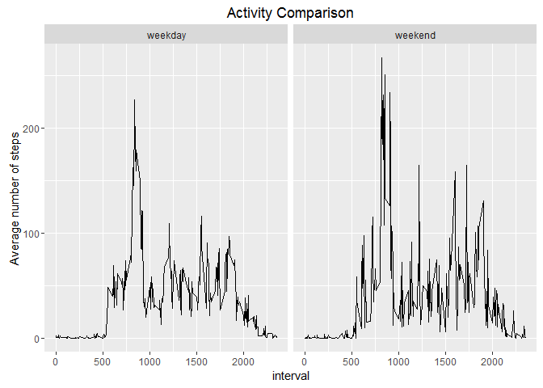

# Reproducible Research: Peer Assessment 1
Ritayan B  
8 February 2016  


### Loading and preprocessing the data
####Unzipping the data assuming that the data is stored in the working directory


```r
unzip("activity.zip")
```

####Loading required packages


```r
library(lubridate)
library(dplyr)
```

```
## 
## Attaching package: 'dplyr'
```

```
## The following objects are masked from 'package:lubridate':
## 
##     intersect, setdiff, union
```

```
## The following objects are masked from 'package:stats':
## 
##     filter, lag
```

```
## The following objects are masked from 'package:base':
## 
##     intersect, setdiff, setequal, union
```

```r
library(ggplot2)
```

####Reading and preprocessing the data

```r
activity <- read.csv("activity.csv")
activity$date <- ymd(activity$date)
clean.values <- activity[complete.cases(activity), ]
```

### What is mean total number of steps taken per day?


```r
activity.patt  <- with(data = clean.values, tapply(X = steps, INDEX = date, FUN = sum))
activity.patt  <- data.frame(date = names(activity.patt), tot.steps = activity.patt)
hist(activity.patt$tot.steps, xlab = "Total Steps", 
            main = "Histogram of total number \n of steps taken each day")
```

\

```r
data.frame(Attrib = c("Mean", "Median"), Value = c(mean(activity.patt$tot.steps), median(activity.patt$tot.steps)))
```

```
##   Attrib    Value
## 1   Mean 10766.19
## 2 Median 10765.00
```

### What is the average daily activity pattern?


```r
avg.steps <- with(data = clean.values, tapply(X = steps, INDEX = interval, FUN = mean))
avg.steps  <- data.frame(interval = names(avg.steps), avgsteps = avg.steps)

avg.steps <- clean.values %>% group_by(interval) %>% summarize(avgsteps = mean(steps))

with(avg.steps, plot(y = avgsteps,  x = interval, type = "l"))
```

\

### Imputing missing values

####Calculation of total number of missing values


```r
print(paste("Total number of null values :" , sum(is.na(activity$steps))))
```

```
## [1] "Total number of null values : 2304"
```

#### We'll use mean values already calculated in previous steps. The values are already calculated in above steps. Assignment of value will be done in following lines.

####We are creating a new variable "filled.activity" that will have average steps filled in place of NA


```r
filled.activity <- activity
nulls <- filled.activity[!complete.cases(filled.activity),]
for(i in 1:length(unique(nulls$date))){
  filled.activity[which(filled.activity$date == unique(nulls$date)[i]),]$steps <- as.numeric(avg.steps$avgsteps)
}
```

####Histogram of the total number of steps taken each day and Calculate and report the mean and median total number of steps taken per day


```r
filled.activity.patt <- filled.activity %>% group_by(date) %>% summarize(tot.steps = sum(steps))
hist(filled.activity.patt$tot.steps, xlab = "Total Steps", 
            main = "Histogram of total number \n of steps taken each day(null values amputed)")
```

\

####Comparison of original and filled in mean and median steps values


```r
data.frame(Labels = c("Original","Amputated"), Means = c(mean(clean.values$steps), mean(filled.activity$steps)),
                    Medians =  c(median(clean.values$steps), median(filled.activity$steps)))
```

```
##      Labels   Means Medians
## 1  Original 37.3826       0
## 2 Amputated 37.3826       0
```

####We do not see much differences in the values before and after the missing value amputation

####Comparison of original and filled in daily activity values


```r
data.frame(Labels = c("Original","Amputated"), Means = c(mean(activity.patt$tot.steps), mean(filled.activity.patt$tot.steps)),
                    Medians = c(median(activity.patt$tot.steps), median(filled.activity.patt$tot.steps)))
```

```
##      Labels    Means  Medians
## 1  Original 10766.19 10765.00
## 2 Amputated 10766.19 10766.19
```

### Are there differences in activity patterns between weekdays and weekends?

#### Creation of new factor variable in the dataset with two levels - "weekday" and "weekend" indicating whether a given date is a weekday or weekend day.


```r
filled.activity$day <- weekdays(filled.activity.patt$date)
filled.activity$day.ind <- "weekday"
filled.activity[filled.activity$day %in% c("Sunday","Saturday"),]$day.ind <- "weekend"
```

####Comparison of average steps in wekdays and weekdays


```r
filled.activity.patt <- filled.activity %>% group_by(interval, day.ind) %>% summarize(steps = mean(steps))
g <- ggplot(data = filled.activity.patt, ylab = "Average Steps") + geom_line(aes(x = interval, y = steps)) 
g <- g + facet_wrap(~day.ind) + ggtitle(label = "Activity Comparison") + ylab("Average number of steps")
g
```

\
